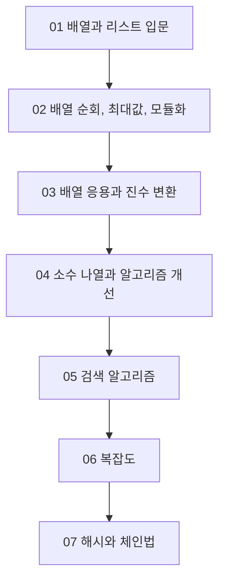

# 허브 - Home

이 Vault의 출발점이다. 앞으로는 이 노트 하나만 열어도 전체 구조와 공부 순서를 이해할 수 있게 만든다.

> [!info] 이 Vault의 원칙
> 강의 노트와 실습 코드를 분리하지 않는다.
> 개념 노트 하나 안에 `왜 필요한가`, `직관`, `의사코드`, `실제 코드`, `왜 맞는가`, `왜 빨라지는가`, `자주 틀리는 점`을 함께 넣는다.

## 이 Vault를 어떤 기준으로 업그레이드했는가

이번 버전은 단순 요약본이 아니라, 실제 상위권 입문 수업들이 자주 강조하는 설명 순서를 참고해 다시 구성했다.

- 문제를 먼저 던진다.
- 그 문제가 왜 생기는지 일상 비유로 연결한다.
- 구현 전에 아이디어와 불변식부터 설명한다.
- 의사코드로 사고 흐름을 먼저 세운다.
- 실제 코드는 그 의사코드를 번역한 것으로 읽게 만든다.
- 마지막에 성능, 한계, 실수 포인트를 분리해서 설명한다.

이 방식은 특히 아래 설명 원칙과 잘 맞는다.

- 코드를 바로 읽기 전에 문제의 배경과 필요성을 먼저 이해한다.
- 구현 전에 직관과 불변식으로 사고의 뼈대를 세운다.
- 설계와 구현을 분리해서 읽고, 시간과 공간의 trade-off를 함께 본다.
- 한 문제를 여러 표현 방식으로 바꿔 보며 더 좋은 모델을 찾는다.

## 원본 실습 코드를 읽는 공통 프레임

`assets/교재의 원본 실습코드들`의 실습 코드는 파일이 많아 보이지만, 실제 학습 흐름은 몇 가지 반복 패턴으로 정리된다.

### 1. 입문형 실습

`chap01` 초반과 `chap02` 일부는 아직 "최적화"보다 **표현을 바꾸는 훈련**에 가깝다.

- 값을 따로 두지 않고 묶는다
- 조건문과 반복문의 모양을 바꿔 본다
- 같은 작업을 함수로 분리한다
- 같은 데이터를 리스트, 튜플, 입력 버전으로 다시 다뤄 본다

이 구간은 비효율 개선보다, **문제를 코드로 표현하는 기본 문법과 사고 틀**을 세우는 단계다.

### 2. 개선형 실습

`chap02` 후반부터는 분명한 패턴이 반복된다.

```text
기본 코드 제시
-> 어디가 비효율적인지 드러냄
-> 불필요한 검사나 중복 연산을 찾음
-> 조건, 저장 방식, 탐색 범위를 바꿔 개선
-> verbose/trace 버전으로 과정까지 확인
```

대표적인 예시는 다음과 같다.

- `prime1 -> prime2 -> prime3 -> prime3a`
- `ssearch_while -> ssearch_sentinel -> bsearch`
- `bubble_sort1 -> bubble_sort2 -> bubble_sort3`
- `recur1 -> recur1a -> recur1b`
- `quick_sort1 -> quick_sort1_non_recur -> quick_sort2`

즉, 원본 실습 폴더는 단순 코드 창고가 아니라
**"비효율을 발견하고, 그 원인을 설명하고, 개선안을 구현하는 연습 묶음"** 으로 읽어야 한다.

### 3. 현재 개념노트가 반영하는 방식

현재 개념노트는 원본 파일을 1:1 요약하지 않는다.
대신 아래 구조로 재구성한다.

```text
문제 상황
-> 기본 구현
-> 왜 비효율적인가
-> 어떤 정보/전제를 추가하면 빨라지는가
-> 개선 버전의 핵심 아이디어
-> trade-off
```

그래서 앞으로 노트를 읽을 때는 "무슨 코드가 있었나"보다
"왜 이 코드 다음에 저 코드가 나오는가"를 먼저 붙잡는 것이 맞다.

## 원본 영상과의 대조 결과

최종 점검에서는 `assets`의 6개 영상을 다시 훑어 범위 일치 여부를 재확인했다.

- 제목 영역: 60초 간격 재스캔
- 전체 슬라이드: 180초 간격 재확인
- 확인 결과: 현재 7개 개념 노트는 큰 주제 범위를 모두 포함한다.

### 특히 다시 보강한 부분

- `2-1`: 주석, 자료형 힌트, 모듈 테스트의 의미
- `3-1`: 배열 검색, 보초법의 실제 코드 흐름, 이진 검색의 정렬 전제
- `3-2`, `3-3`: 정렬된 배열 삽입의 한계, Node의 역할, dump와 메뉴 프로그램

### 현재 판단

- 큰 범위 누락: 없음
- 핵심 소주제 누락: 없음
- 남은 한계: 음성 전사 없이 화면 중심으로 정리했으므로, 교수의 구두 비유나 즉흥적 보충 설명은 요약되었을 수 있다.

## 가장 먼저 볼 노트

1. [[01 - 배열과 리스트 입문]]
2. [[02 - 배열 순회, 최대값, 모듈화]]
3. [[03 - 배열 응용과 진수 변환]]

## 주차 관리

### 2주차

- 영상: `2-1`, `2-2`, `2-3`
- 핵심 질문: 데이터를 어떻게 묶고, 순회하고, 변환하고, 같은 정답을 더 적은 계산으로 구할 것인가?
- 실제 범위: 배열 필요성, 리스트/튜플, 인덱싱/슬라이싱, 최대값, 함수 분리, 주석과 자료형 힌트, 배열 뒤집기, 진수 변환, 소수 나열, 알고리즘 개선
- 연결 노트: [[01 - 배열과 리스트 입문]], [[02 - 배열 순회, 최대값, 모듈화]], [[03 - 배열 응용과 진수 변환]], [[04 - 소수 나열과 알고리즘 개선]]
- 상태: 개념 노트 업그레이드 완료

### 3주차

- 영상: `3-1`, `3-2`, `3-3`
- 핵심 질문: 기본 검색/저장 방식이 왜 비효율적인지 드러낼 때, 어떤 전제와 자료구조를 추가해야 더 빨라지는가?
- 실제 범위: 검색과 키, 배열 검색, 선형 검색, 보초법, 이진 검색, 복잡도, 정렬된 배열 삽입의 한계, 해시법, 충돌, 체인법, ChainedHash 메뉴 프로그램
- 연결 노트: [[05 - 검색 알고리즘]], [[06 - 복잡도]], [[07 - 해시와 체인법]]
- 상태: 개념 노트 업그레이드 완료

## 빠른 이동

- 바로 공부 시작: [[01 - 배열과 리스트 입문]]
- 최적화 감각이 약하면: [[04 - 소수 나열과 알고리즘 개선]]
- 검색이 헷갈리면: [[05 - 검색 알고리즘]]
- 가장 어려운 파트로 점프: [[07 - 해시와 체인법]]
- 문제은행 바로 열기: [[20_문제은행/00_문제은행 허브]]

## 이 Vault의 큰 흐름



## 권장 읽기 순서

1. [[01 - 배열과 리스트 입문]]
2. [[02 - 배열 순회, 최대값, 모듈화]]
3. [[03 - 배열 응용과 진수 변환]]
4. [[04 - 소수 나열과 알고리즘 개선]]
5. [[05 - 검색 알고리즘]]
6. [[06 - 복잡도]]
7. [[07 - 해시와 체인법]]

## 읽는 방법

- 노트의 `왜 이걸 배우는가`를 먼저 읽는다.
- 가능하면 대응하는 원본 실습 파일 제목을 먼저 훑고, 어떤 파일이 기본형이고 어떤 파일이 개선형인지 본다.
- `직관`과 `비유`를 통해 머릿속 그림을 만든다.
- `의사코드`를 보고 풀이 흐름을 큰 소리로 설명한다.
- `왜 비효율적인가 / 어떻게 개선하는가`를 따로 요약해 본다.
- `실제 코드`를 의사코드와 한 줄씩 대응한다.
- `왜 맞는가 / 왜 빨라지는가`를 읽으며 개념을 고정한다.
- 마지막의 `스스로 점검`에 답하며 회독을 마친다.

## 실습 폴더 사용 원칙

`assets/교재의 원본 실습코드들`은 앞으로 개념노트의 보조 실습 폴더로 사용한다.

- 개념노트가 있는 챕터만 학습 축으로 적극 연결한다.
- 실습 파일은 "최종 정답 모음"이 아니라 "개선 과정 기록"으로 읽는다.
- `verbose`, `test`, `*_ve`, `수정`, `개선` 파일명은 보조 구현이 아니라 학습 의도가 드러난 표지로 본다.
- 개념노트를 업데이트할 때는 먼저 해당 장에서 `기본형 -> 비효율 원인 -> 개선형` 흐름이 있는지 확인한다.

## 7일 루틴

1. 1일차: [[01 - 배열과 리스트 입문]]
2. 2일차: [[02 - 배열 순회, 최대값, 모듈화]]
3. 3일차: [[03 - 배열 응용과 진수 변환]]
4. 4일차: [[04 - 소수 나열과 알고리즘 개선]]
5. 5일차: [[05 - 검색 알고리즘]]
6. 6일차: [[06 - 복잡도]]
7. 7일차: [[07 - 해시와 체인법]] + [[20_문제은행/07_해시와 체인법 문제은행]]

## 문제은행

- 문제은행 허브: [[20_문제은행/00_문제은행 허브]]
- 배열과 리스트: [[20_문제은행/01_배열과 리스트 문제은행]]
- 배열 순회와 최대값: [[20_문제은행/02_배열 순회와 최대값 문제은행]]
- 배열 응용과 진수 변환: [[20_문제은행/03_배열 응용과 진수 변환 문제은행]]
- 소수와 알고리즘 개선: [[20_문제은행/04_소수와 알고리즘 개선 문제은행]]
- 검색 알고리즘: [[20_문제은행/05_검색 알고리즘 문제은행]]
- 복잡도: [[20_문제은행/06_복잡도 문제은행]]
- 해시와 체인법: [[20_문제은행/07_해시와 체인법 문제은행]]
https://github.com/easysIT/doit_dsalgo_with_python
