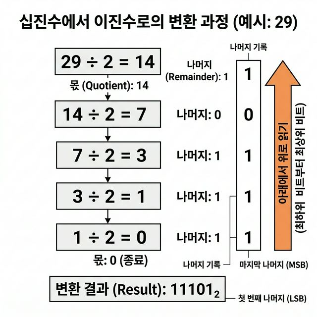

# 03 - 배열 응용과 진수 변환

> [!info] 이 노트에서 끝내야 할 것
> 1. 배열 뒤집기 구조를 설명할 수 있다.  
> 2. 기수 변환하기 알고리즘을 말로 설명할 수 있다.  
> 3. 나머지를 모아 뒤집는 이유를 이해한다.  
> 4. 파이썬 함수 선언, 매개변수, 반환값, `while`, `%`, `//`, `join`을 기수 변환 코드 안에서 읽을 수 있다.

## 1. 왜 이 노트가 중요한가

앞 노트까지는 배열을 "보관"하고 "순회"하는 데 익숙해지는 단계였다면,  
이번 노트는 배열을 **조작하고 응용하는 단계**다.

특히 두 가지 장면이 중요하다.

- 배열 뒤집기: 위치를 바꾸는 사고
- 기수 변환하기: 숫자 문제를 배열/문자열 문제로 바꾸는 사고

즉, 여기서부터 배열은 단순 저장소가 아니라 **문제 해결 도구**가 된다.

## 2. 배열 뒤집기

### 직관적 비유

양쪽 끝에 앉은 사람끼리 자리를 바꾸며 안쪽으로 들어간다고 생각하면 된다.

예를 들어

```text
[2, 5, 1, 3, 9, 6, 7]
```

이라면,

- 첫 번째와 마지막을 바꾸고
- 두 번째와 뒤에서 두 번째를 바꾸고
- 가운데에 도달하면 끝난다

### 왜 절반만 반복하는가

앞과 뒤를 한 번 바꾸면 그 쌍은 끝이다.  
끝까지 계속 돌면 같은 쌍을 다시 만나 원래대로 되돌릴 수 있다.

### 의사코드

```text
배열 길이를 n이라고 한다
0부터 n // 2 - 1까지 반복한다
왼쪽 원소와 오른쪽 대응 원소를 교환한다
```

### Python 코드

```python
from typing import Any, MutableSequence

def reverse_array(a: MutableSequence) -> None:
    """뮤터블 시퀀스형 a의 원소를 역순으로 정렬"""
    n = len(a)
    for i in range(n // 2):
         a[i], a[n - i - 1] = a[n - i - 1], a[i]
```

### 왜 맞는가

반복문이 한 번 돌 때마다,

- 왼쪽 끝에서 아직 손대지 않은 원소 하나
- 오른쪽 끝에서 아직 손대지 않은 원소 하나

를 제자리에 옮긴다.  
이 과정을 절반까지만 반복하면 전체가 뒤집힌다.

## 3. 기수 변환하기는 왜 배열 단원에 들어가나

겉으로 보면 기수 변환은 수학 문제다.  
하지만 실제 구현은 다음 단계를 포함한다.

1. 중간 결과를 순서대로 저장한다.
2. 그 결과가 역순임을 이해한다.
3. 숫자를 문자 기호로 바꾼다.
4. 최종 문자열을 조립한다.

즉, 본질적으로는 **배열/문자열 처리 문제**다.

그래서 "기수 변환하기"는 숫자 계산 문제이면서 동시에  
리스트에 값을 쌓고 뒤집고 합치는 배열 응용 문제다.

## 4. 직관적 비유: 택배 상자 묶기

29개의 물건을 2개씩 묶는다고 생각해 보자.

- 29개를 2개씩 묶으면 14상자와 1개 남는다
- 14개를 다시 2개씩 묶으면 7상자와 0개 남는다
- 7개를 다시 2개씩 묶으면 3상자와 1개 남는다
- 3개를 다시 2개씩 묶으면 1상자와 1개 남는다
- 1개를 다시 2개씩 묶으면 0상자와 1개 남는다

이때 매번 남는 물건 수가 바로 **현재 자리의 숫자**다.

즉,

- 나머지 = 현재 자리값
- 몫 = 다음 단계에서 다시 처리할 수

다.

## 5. 의사코드

```text
숫자가 0이 될 때까지 반복한다
현재 숫자를 base로 나눈 나머지를 기록한다
현재 숫자를 base로 나눈 몫으로 바꾼다
기록된 나머지들은 역순이므로 마지막에 뒤집는다
문자들을 이어 붙여 최종 문자열을 만든다
```

## 6. 기수 변환하기: 초보자용 큰 그림

이 문제를 실제 프로그램으로 옮기면 아래 순서가 된다.

1. 빈 리스트를 하나 만든다.
2. 나머지를 구할 때마다 그 리스트에 문자를 넣는다.
3. 반복이 끝나면 리스트를 뒤집는다.
4. 리스트 원소들을 문자열 하나로 이어 붙인다.

이 네 단계가 바로 "배열 개념 안에서 기수 변환하기"의 핵심이다.

## 7. 파이썬 함수 문법부터 다시 읽기

초보자에게는 아래 같은 함수 정의 한 줄부터 부담스러울 수 있다.

```python
def card_conv(x: int, r: int) -> str:
```

이 한 줄을 천천히 쪼개서 읽어 보자.

- `def`: 함수를 만들겠다는 뜻이다.
- `card_conv`: 진수 변환 함수 이름이다.
- `x`: 바꾸고 싶은 10진수 정수다.
- `r`: 몇 진수로 바꿀지 나타내는 정수다.
- `-> str`: 이 함수가 마지막에 문자열을 돌려준다는 뜻이다.

예를 들어,

```python
card_conv(29, 2)
```

는 "29를 2진수 문자열로 바꿔라"는 호출이다.

여기서 같이 알아 두면 좋은 용어도 정리하자.

- 매개변수(parameter): 함수가 입력으로 받는 값
- 반환값(return value): 함수가 계산 후 돌려주는 값
- 지역 변수(local variable): 함수 안에서만 쓰는 임시 변수

## 8. 실습 코드 A: 리스트를 이용한 가장 읽기 쉬운 버전

아래 코드는 원본 `card_conv.md`의 핵심 구현이다.  
의도적으로 문자열을 뒤에서부터 붙인 뒤 마지막에 뒤집는다.  
배열을 별도로 두지 않더라도, **낮은 자리부터 결과가 나온다**는 사실을 그대로 노출하는 설계다.

```python
def card_conv(x: int, r: int) -> str:
    """정수 x를 r 진수로 변환한 뒤 그 수를 나타내는 문자열을 반환"""

    d = ''
    dchar = '0123456789ABCDEFGHIJKLMNOPQRSTUVWXYZ'

    while x > 0:
        d += dchar[x % r]
        x //= r

    return d[::-1]
```

## 9. 이 코드를 정말 천천히 읽어 보기

### `dchar = '0123456789ABCDEFGHIJKLMNOPQRSTUVWXYZ'`

이 문자열은 "숫자 -> 문자" 번역표다.

- 나머지가 `0`이면 `"0"`
- 나머지가 `9`이면 `"9"`
- 나머지가 `10`이면 `"A"`
- 나머지가 `15`이면 `"F"`

즉, 숫자 그 자체를 출력하는 것이 아니라,  
**각 자리값을 사람이 읽는 문자로 바꾸는 표**다.

### `d = ''`

결과를 누적할 문자열이다.  
여기에는 정답 순서가 아니라 **역순의 자리 문자**가 쌓인다.

### `dchar = '0123456789ABCDEFGHIJKLMNOPQRSTUVWXYZ'`

숫자 값을 문자로 바꾸는 테이블이다.

### `x % r`

`%`는 나머지를 구하는 연산자다.  
현재 자리의 숫자를 꺼낸다고 생각하면 된다.

### `dchar[x % r]`

문자표에서 현재 자리값에 해당하는 문자 하나를 꺼낸다.

예를 들어 16진수에서 나머지가 10이면 숫자 `10`을 그대로 출력하지 않고 `"A"`를 꺼낸다.

### `d += ...`

방금 구한 자리 문자를 뒤에 덧붙인다.  
문제는 이 순서가 사람이 읽는 최종 순서와 반대라는 점이다.

### `x //= r`

`//`는 몫만 남기는 정수 나눗셈이다.  
이미 처리한 가장 낮은 자리 하나를 떼어 내고, 다음 자리 계산으로 넘어간다.

### `return d[::-1]`

핵심 마무리다.  
낮은 자리부터 쌓인 문자열을 마지막에 뒤집어 정답 순서로 되돌린다.

## 10. 29를 2진수로 바꿀 때 문자열이 어떻게 쌓이나

`number = 29`, `base = 2`일 때를 따라가 보자.

| x | remainder | 추가되는 문자 | d 상태 |
| --- | --- | --- | --- |
| 29 | 1 | `"1"` | `"1"` |
| 14 | 0 | `"0"` | `"10"` |
| 7 | 1 | `"1"` | `"101"` |
| 3 | 1 | `"1"` | `"1011"` |
| 1 | 1 | `"1"` | `"10111"` |

반복이 끝난 뒤에는

```python
d[::-1]
```

를 수행하므로

```python
'11101'
```

가 된다.

## 11. 왜 `dchar` 문자열이 필요한가

10진수까지만 다루면 `0~9` 숫자만 있으면 된다.  
하지만 16진수 이상은 `A, B, C, ...` 같은 문자가 필요하다.

그래서 다음처럼 표를 미리 준비해 둔다.

```python
dchar = '0123456789ABCDEFGHIJKLMNOPQRSTUVWXYZ'
```

그러면 나머지가 10이면 `A`, 11이면 `B`처럼 바로 꺼낼 수 있다.

이 방식은 "숫자를 문자로 번역하는 표"를 코드에 집어넣은 것이다.

## 12. 29를 2진수로 바꾸는 과정을 손으로 해 보기

```text
29 = 14 * 2 + 1
14 =  7 * 2 + 0
 7 =  3 * 2 + 1
 3 =  1 * 2 + 1
 1 =  0 * 2 + 1
```

나머지들을 위에서 아래로 읽으면 `10111`처럼 보이지만,  
실제로는 **아래에서 위로** 읽어야 하므로 정답은 `11101`이다.



이 지점이 핵심이다.

> [!tip] 왜 뒤집어야 하나?
> 먼저 나온 나머지는 가장 낮은 자리수(1의 자리)이고,  
> 나중에 나온 나머지는 더 높은 자리수이기 때문이다.

## 13. 실습 코드 B: `divmod`를 이용한 압축 버전

원본 책은 여기서 굳이 다른 추상화를 먼저 도입하지 않는다.  
이 선택이 좋은 이유는, `%`, `//`, 역순 복원의 관계가 가장 직접적으로 드러나기 때문이다.  
기저 원리를 완전히 이해하기 전에는 지나친 압축이 오히려 독해 비용을 높인다.

## 14. 과정을 보이게 하는 심화 버전

원본 강의는 결과만 출력하는 버전에서 멈추지 않고, 계산 과정을 자세히 보여 주는 심화 버전도 다룬다.

```python
def card_conv(x: int, r: int) -> str:
    """정수 x를 r 진수로 변환한 뒤 그 수를 나타내는 문자열을 반환"""

    d =  ''
    dchar = '0123456789ABCDEFGHIJKLMNOPQRSTUVWXYZ'
    n = len(str(x))

    print(f'{r:2} | {x:{n}d}')
    while x > 0:
        print('   +' + (n + 2) * '-')
        if x // r:
            print(f'{r:2} | {x // r:{n}d} … {x % r}')
        else:
            print(f'     {x // r:{n}d} … {x % r}')
        d += dchar[x % r]
        x //= r

    return d[::-1]
```

이 코드는 단순 정답 출력보다 교육적으로 훨씬 좋다.  
왜냐하면 알고리즘이 "무슨 결과를 내는지"뿐 아니라, "어떤 과정을 거치는지"를 눈으로 보이게 해 주기 때문이다.

## 15. 이 노트의 핵심은 무엇인가

이 단원에서 중요한 것은 "같은 기술을 다른 문제에 어떻게 옮겨 붙일 수 있는가"를 보는 것이다.  
이 노트가 바로 그렇다.

- 배열 뒤집기에서는 양끝에서 중앙으로 좁혀 오는 사고를 배운다.
- 기수 변환하기에서는 나머지를 모아 역순 처리하는 사고를 배운다.

둘 다 표면은 다르지만, 실제로는 "배열의 위치와 순서"를 다루는 문제다.

## 16. 더 깊게 보면 무엇이 같은가

배열 뒤집기와 기수 변환하기는 겉모습이 다르다.

- 배열 뒤집기: 값을 교환한다
- 기수 변환하기: 나머지를 쌓고 뒤집는다

하지만 둘 다 결국은 **순서가 정답에 직접 영향을 미치는 문제**다.

이 감각은 나중에

- 문자열 뒤집기
- 스택을 이용한 역순 처리
- 후입선출 구조 이해

로 이어진다.

즉, 이 단원은 "배열을 다루는 법"을 넘어서 **순서를 설계하는 법**을 배우는 단원이다.

## 17. 자주 하는 실수

- 배열 뒤집기에서 끝까지 반복해 같은 원소 쌍을 두 번 바꾸기
- 기수 변환하기에서 나머지를 모은 순서가 곧 정답이라고 착각하기
- `0` 입력 처리 없이 바로 반복문으로 들어가기
- 16진수 이상에서 문자표를 준비하지 않기
- `def`, `return`, `join`, `append` 같은 기본 문법을 건너뛰고 함수 전체를 통째로 외우기

## 18. 원본 실습 코드 커리큘럼 반영

이 노트는 원본 `chap02`의 배열 응용 파트를 거의 그대로 계승하되, "순서 설계"라는 공통 원리로 두 주제를 하나로 묶어 설명한다.

- 배열 뒤집기: `reverse.md`, `reverse2.md`
- 진수 변환 기본 구현: `card_conv.md`
- 진수 변환 과정 출력: `card_conv_verbose.md`

원본에서는 뒤집기와 진수 변환이 별도 실습으로 보이지만, 현재 노트는 둘을 "결과 순서가 핵심인 문제"로 연결했다. 앞의 실습에서는 양끝 교환을, 뒤의 실습에서는 나머지 누적 후 역순 복원을 통해 같은 순서 조작 감각을 훈련한다.

이 장의 공통 구조는 다음과 같다.

```text
문제의 결과 순서가 바로 나오지 않는다
-> 중간 결과를 임시로 저장하거나 교환한다
-> 마지막에 정답 순서로 복원한다
```

즉, 아직은 "더 빠르게"보다 **순서를 설계해서 문제를 풀 수 있게 만드는 개선**이 핵심이다.

## 19. 스스로 점검

1. 배열 뒤집기는 왜 `n // 2`번만 바꾸면 되는가?
2. 기수 변환하기에서 나머지는 왜 역순으로 쌓이는가?
3. `dchar` 문자열은 어떤 문제를 해결하는가?
4. `def card_conv(x: int, r: int) -> str:`를 조각내어 설명할 수 있는가?
5. 왜 이 구현이 문자열을 역순으로 누적한 뒤 마지막에 뒤집는지 설명할 수 있는가?
6. 29를 2진수로 바꾸는 과정을 손으로 다시 적을 수 있는가?

## 다음 노트

- [[04 - 소수 나열과 알고리즘 개선]]
