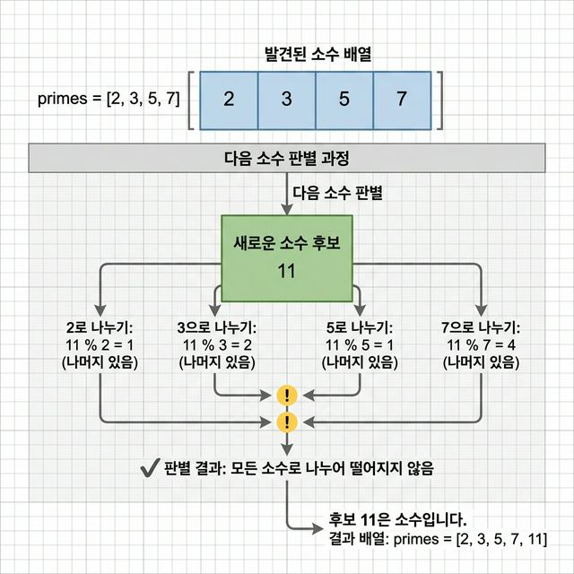
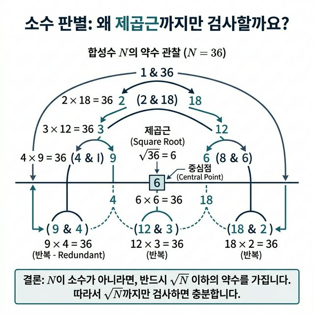

# 04 - 소수 나열과 알고리즘 개선

> [!info] 이 노트에서 끝내야 할 것
> 1. 단순 버전과 개선 버전의 차이를 설명할 수 있다.  
> 2. 왜 짝수를 건너뛰는지 설명할 수 있다.  
> 3. 왜 `p * p <= n`까지만 검사하는지 설명할 수 있다.

## 1. 왜 이 노트가 중요한가

이번 노트는 "같은 정답을 더 똑똑하게 얻는 법"을 배우는 구간이다.  
이전까지는 올바른 답을 얻는 것이 중심이었다면, 여기서는 **더 적은 연산으로 답을 얻는 방법**이 중심이 된다.

이 단계는 단순 구현을 넘어서 **패턴을 인식하고 trade-off를 정량적으로 보는 단계**다.

## 2. 먼저 소수와 합성수

- 소수: 1과 자기 자신만으로 나누어떨어지는 수
- 합성수: 그 외의 약수를 하나 이상 가지는 수

예를 들어,

- 7은 소수다
- 12는 2, 3, 4, 6으로도 나누어떨어지므로 합성수다

강의는 이 정의를 그냥 외우게 하지 않고, 실제 나눗셈 횟수와 연결해 보여 준다.

## 3. 단순 버전은 어떻게 생각하나

가장 순진한 방법은 이렇다.

> 어떤 수 `n`이 소수인지 보려면 2부터 `n-1`까지 전부 나눠본다.

### 의사코드

```text
2부터 limit까지 모든 수를 본다
각 수에 대해 2부터 n-1까지 나눠본다
하나도 나누어떨어지지 않으면 소수로 기록한다
```

### Python 코드

```python
counter = 0

for n in range(2, 1001):
    for i in range(2, n):
        counter += 1
        if n % i == 0:
            break
    else:
        print(n)
print(f'나눗셈을 실행한 횟수: {counter}')
```

### 장점

- 이해하기 쉽다
- 틀리기 어렵다

### 단점

- 너무 많은 나눗셈을 한다
- 같은 종류의 일을 계속 중복한다

## 4. 왜 느린가를 직관적으로 보기

17이 소수인지 확인하려면, 단순 버전은 2, 3, 4, 5, ..., 16으로 다 나눠본다.  
하지만 이미 4는 2와 겹치고, 6은 2와 3의 조합이며, 16은 4의 제곱이다.

즉, **필요 없는 검사가 많다**.

여기서 중요한 것은 단순히 빠른 코드를 외우는 것이 아니라  
"이미 알고 있는 정보를 다음 계산에 재활용할 수 있는가?"를 보는 관점이다.

## 5. 개선 1: 짝수는 건너뛴다

2를 제외한 짝수는 소수가 아니다.  
그러므로 5부터는 홀수만 후보로 보면 된다.

이건 사소해 보이지만, 후보 수를 거의 절반으로 줄인다.

## 6. 개선 2: 이미 찾은 소수를 재사용한다

강의의 중요한 아이디어는 `prime` 배열을 만드는 것이다.

이 배열에는 지금까지 찾은 소수들이 들어 있다.  
새 후보가 나오면 모든 수로 나눌 필요 없이, **이미 찾은 소수들로만** 나눠보면 된다.

왜냐하면 합성수의 약수는 결국 소수들의 곱으로 만들어지기 때문이다.

즉, "새로운 검사를 할 때 과거 계산 결과를 재사용"하는 구조다.



## 7. 개선 3: 제곱근까지만 본다

이 부분이 가장 중요하다.

### 왜 그런가

어떤 수 `n`이 합성수라면 약수는 쌍으로 나타난다.

예를 들어 36의 약수 쌍은

- 2 × 18
- 3 × 12
- 4 × 9
- 6 × 6

이다.

이 쌍 중 하나가 제곱근보다 크다면, 다른 하나는 반드시 제곱근보다 작다.  
그러므로 제곱근보다 작은 약수들을 다 확인했는데 아무것도 안 나왔다면, 큰 쪽 약수도 새 정보가 아니다.

그래서 `p * p <= n`까지만 보면 된다.

### 한 문장으로 압축하면

> 제곱근 이후의 검사는 제곱근 이전 검사와 짝을 이루는 중복 정보다.



## 8. 개선 버전 의사코드

```text
2와 3을 먼저 저장한다
5부터 limit까지 홀수만 후보로 본다
이미 찾은 소수 p들에 대해 p * p <= candidate 범위까지만 나눠본다
끝까지 나누어떨어지지 않으면 소수 배열에 추가한다
```

## 9. 개선 1 Python 코드

```python
counter = 0
ptr = 0
prime = [None] * 500

prime[ptr] = 2
ptr += 1

for n in range(3, 1001, 2):
    for i in range(1, ptr):
        counter += 1
        if n % prime[i] == 0:
            break
    else:
        prime[ptr] = n
        ptr += 1

for i in range(ptr):
    print(prime[i])
print(f'나눗셈을 실행한 횟수: {counter}')
```

이 버전은 원본 `prime2.md`다.  
핵심은 두 가지다.

- 후보를 홀수로 제한해 검사 대상을 줄인다.
- 이미 검증된 소수 배열 `prime`만 약수 후보로 재사용한다.

## 10. 개선 버전 Python 코드

```python
counter = 0
ptr = 0
prime = [None] * 500

prime[ptr] = 2
ptr += 1

prime[ptr] = 3
ptr += 1

for n in range(5, 1001, 2):
    i = 1
    while prime[i] * prime[i] <= n:
        counter += 2
        if n % prime[i] == 0:
            break
        i += 1
    else:
        prime[ptr] = n
        ptr += 1
        counter += 1

for i in range(ptr):
    print(prime[i])
print(f'곱셈과 나눗셈을 실행한 횟수: {counter}')
```

## 11. 이 코드의 핵심 불변식

개선 버전은 단순 버전보다 똑똑하지만, 그렇다고 마법은 아니다.  
다음 불변식이 성립하기 때문에 맞는다.

> 현재 후보 `n`을 검사하기 전, `prime` 배열의 앞부분에는 `n`보다 작은 소수들이 들어 있다.

이 불변식이 맞다면,

- 새 후보는 그 소수들만 검사하면 되고
- 그중 제곱근 이하 범위에서 나누어떨어지지 않으면
- 더 이상 새로운 약수는 없으므로 소수다

라는 결론이 따라온다.

## 12. 왜 이게 "배열 응용"이기도 한가

표면적으로는 수학 문제처럼 보이지만, 실제로는

- 찾은 소수들을 배열에 저장하고
- 그 배열을 반복해서 읽고
- 그 배열을 다음 계산의 재료로 쓴다

는 점에서 강한 배열 응용 문제다.

즉, 이 노트는 수학 문제를 빌려 **배열을 정보 저장소이자 가속 장치로 쓰는 법**을 가르친다.

## 13. 시간과 공간의 trade-off

개선 버전은 더 빠르지만, 아예 공짜는 아니다.

- 장점: 나눗셈 횟수가 크게 줄어든다
- 비용: 찾은 소수들을 저장할 배열이 필요하다

즉, **메모리를 조금 써서 시간을 절약**한다.

이 감각이 다음 `복잡도` 노트로 자연스럽게 이어진다.

## 14. 숫자로 체감해 보기

예를 들어 `97`이 소수인지 검사한다고 하자.

- 단순 버전은 `2`부터 `96`까지 거의 전부 시도할 수 있다.
- 제곱근 기준을 쓰면 `9`까지만 보면 된다.

왜냐하면 `10 * 10 = 100`이므로,  
`97`에 약수가 있다면 그 약수 쌍 중 작은 쪽은 반드시 9 이하에 있기 때문이다.

즉, `10`부터 `96`까지의 검사는 처음부터 대부분 필요 없는 검사가 된다.

이 차이를 손으로 한 번만 써 봐도  
"조건 하나가 성능을 얼마나 바꾸는지"가 체감된다.

## 15. 자주 하는 실수

- 짝수 후보를 계속 포함시켜 불필요한 계산을 반복하기
- `p * p <= n` 조건을 빼먹고 끝까지 다 나눠보기
- `primes` 배열이 이미 무엇을 보장하고 있는지 이해하지 못한 채 코드만 외우기
- "빨라졌다"를 느끼기만 하고, 왜 빨라졌는지 설명하지 못하기

## 16. 원본 실습 코드 커리큘럼 반영

이 노트는 원본 `chap02`의 소수 나열 실습 네 개를 "같은 문제를 점점 덜 비싸게 푸는 과정"으로 통합한 것이다.

- 단순 소수 나열: `prime1.md`
- 알고리즘 개선 1: `prime2.md`
- 알고리즘 개선 2: `prime3.md`
- 배열 길이를 유연하게 둔 개선 버전: `prime3a.md`

현재 노트는 파일을 따로따로 읽는 대신, 네 실습을 하나의 개선 서사로 묶는다. 즉 "모든 수로 나눠본다 -> 짝수를 줄인다 -> 이미 찾은 소수를 재사용한다 -> 배열 운영 방식도 단순화한다"라는 커리큘럼으로 읽게 만든다.

이 노트에서 실습 코드를 읽는 표준 프레임은 다음과 같다.

```text
기본 코드: 정답은 맞지만 검사 수가 많다
-> 비효율 원인: 필요 없는 후보와 중복 나눗셈이 많다
-> 개선 1: 짝수를 건너뛴다
-> 개선 2: 이미 찾은 소수를 재사용한다
-> 개선 3: 제곱근까지만 본다
```

즉, 이 장부터는 원본 실습이 명확하게 **비효율 분석 -> 알고리즘 개선** 흐름으로 읽힌다.

## 17. 스스로 점검

1. 왜 2와 3을 미리 저장하면 편한가?
2. 왜 짝수를 건너뛰어도 되는가?
3. 왜 `p * p <= n`까지만 검사하면 충분한가?
4. 개선 버전은 무엇을 배열에 저장하고, 그걸 어떻게 다시 활용하는가?
5. 이 알고리즘은 시간과 공간 중 무엇을 조금 더 써서 무엇을 아끼는가?

## 다음 노트

- [[05 - 검색 알고리즘]]
